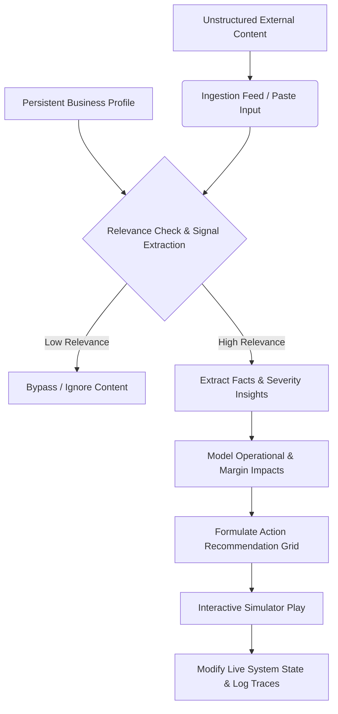

# Cognitive Kinetic — Autonomous Content-to-Action Agent System

Cognitive Kinetic is a React Native mobile application built on Expo that functions as an **Autonomous Content-to-Action Agent System**. It is designed to automatically ingest unstructured external content—such as regional news, policy updates, logistics reports, or operational alerts—analyze it against a saved, persistent business operating context, model its financial and regulatory impacts, recommend concrete mitigating decisions, and simulate action execution to modify system states.

Unlike conversational chatbots or generic summarization tools, CognitiveKinetic provides a structured, automated, and deterministic operational instrument panel. It keeps critical agent reasoning transparent via a step-by-step **Agent Trace Timeline** and an **Interactive Action Simulator**.

---

## 1. System Overview: What It Is & What It Does

CognitiveKinetic automates the transformation of unstructured regional information into tactical business defense actions. It targets logistics, dispatch, and operational teams who need real-time, context-aware analysis and defensive system adaptations.



### The Primary Value Proposition
- **Persistent Context**: Businesses enter their goals, regions, and risk tolerances once. Every piece of ingested content is automatically evaluated against this saved boundary.
- **Action over Summary**: Instead of generating a generic "summary block", the system extracts quantifiable signals (+12% cost variance, 12-hour route bans) and calculates clear short- and medium-term impacts.
- **Actionable State Simulation**: The app features a live, mockable pricing and dispatch database. Users can execute recommended actions to see before/after system configurations alongside technical execution logs.

---

## 2. Core Agentic Pipeline & How It Works

The agent logic is strictly segregated from UI render components, orchestrated by the modules inside `src/services/agent/`. Each analysis run executes the following chronological steps:

### Phase 1: Onboarding Context Selection
Users initialize their profile during onboarding. This profile is persisted locally and loaded automatically at startup:
- **Business Profile Fields**: Business Name, Industry, Operating Locations (e.g. Lahore, Karachi), Key Concerns (e.g. fuel costs, delivery margins, customer churn), and Risk Sensitivity (e.g. balanced, aggressive).

### Phase 2: Unstructured Content Ingestion
The system ingests unstructured text through:
- **Pasted Strategic Content**: Manual entry of market reports or operational alerts.
- **Multi-Source Agent Feed**: User-configured Google News, Reddit, Pakistan provider, and custom RSS sources are fetched server-side and filtered against the saved profile before appearing in the app.

The feed is user-scoped. Source setup is stored at `users/{uid}/settings/newsFeed`, active selected items live under `users/{uid}/feedItems`, and aged idle items move to `users/{uid}/archivedFeedItems`. There is no shared top-level feed cache. Dismissed items are deleted immediately, idle unanalyzed items archive after two days, and archived items are removed after roughly one month. Only analysis runs are treated as permanent history, and each feed-triggered analysis stores an article snapshot with the report.

### Phase 3: Facts & Signals Extraction (`src/services/understanding.js`)
The agent scans the content to extract core data structures:
- **Quantitative Metrics**: Detects percentage fluctuations (e.g. `12% fuel surcharge`) and numeric variances.
- **Jurisdictional Targets**: Flags mentions of defined operational locations (e.g. `Lahore`, `Islamabad`).
- **Severity Rating**: Classifies signals as Low, Medium, or High based on impact indicators.

### Phase 4: Relevance Checks (`src/services/agent/orchestrator.js`)
To avoid analyzing irrelevant noise (like standard celebrity news or local social events), the agent evaluates collected articles against the saved profile and feed prompt:
- **Agent Selection**: Backend functions collect source items, then hand them to the feed-selection agent contract.
- **Low Relevance Bypass**: Items not selected by the agent never reach the frontend feed.

### Phase 5: Severity Insights & Impact Modeling (`src/services/impact.js`)
If relevant, the agent formulates structural impact grids:
- **Short-Term Consequences**: High-level immediate impacts (e.g., immediate 15% drop in route profitability).
- **Medium-Term Risks**: Projected issues (e.g., driver burnout, contract partner friction).
- **Risk Multipliers**: Scales calculated severities dynamically based on the user's saved risk sensitivity (e.g. elevated to "critical" for conservative settings).

### Phase 6: Practical Action Formulations (`src/services/actions.js`)
The agent lists concrete mitigations with key parameters:
- **Action Metadata**: Title, Description, Rationale, Urgency (e.g., critical, medium), and Confidence level.
- **Support Actions**: Distinguishes between manual audits (e.g. "Review System Configuration") and direct system actions supporting real-time simulation.

### Phase 7: Interactive Simulation & State Transition (`src/services/simulation.js`)
Allows developers and operators to test real-world action consequences:
- **Mock System State**: Maintains a live reactive state (e.g., `baseDeliveryFee: Rs. 100`, `longDistanceSurcharge: Rs. 0`, `peakHourSurcharge: Rs. 15`).
- **Before vs After Render**: Displays side-by-side metric tables showing variables changed by execution.
- **Execution Log Trace**: Produces technical developer outputs (e.g. database updates, POST API response status codes, event broadcasts).

---

## 3. Demo Scenarios & System Response

The application comes equipped with standard presets to illustrate its capabilities:

### Scenario A: Surcharge Fuel Adjustments
*   **Saved Profile Context**: Apex Logistics, operating in Lahore, Karachi, and Islamabad, concerned about fuel costs and delivery margins.
*   **Ingested Raw News**: *"Ministry of Energy announced a sudden 12% hike in base fuel and diesel prices, effective immediately."*
*   **Calculated Relevance**: `95%` (Direct match on concerns: "fuel costs" and "delivery margins").
*   **Extracted Insight**: Margin compression of Rs. 18-22 per dispatch corridor.
*   **Recommended Action**: Implement Long-Distance Surcharge (+Rs. 20).
*   **Simulated Output**:
    *   *Before*: Base delivery fee: Rs. 100 | Long-Distance Surcharge: Rs. 0
    *   *After*: Base delivery fee: Rs. 100 | Long-Distance Surcharge: Rs. 20
    *   *System Event Logs*:
        ```text
        [02:35:10] API Request: POST /api/v1/config/pricing-rules
        [02:35:11] Payload: { rule: "long_distance_surcharge", value: 20, active: true }
        [02:35:11] Response Status: 200 OK
        [02:35:12] Database Write: Table [PricingRules] updated row [long_distance] with value [20]
        ```

### Scenario B: Environmental Smog Ban
*   **Saved Profile Context**: Regional courier service operating in Lahore.
*   **Ingested Raw News**: *"Commercial vehicle daytime restrictions on Mall Road Lahore due to environmental smog control."*
*   **Calculated Relevance**: `85%` (Location match: "Lahore", structural constraint matches).
*   **Extracted Insight**: Dispatch peak gridlock and daytime delivery access blocked.
*   **Recommended Action**: Canal Road Rerouting & Peak Surcharge (+Rs. 30).
*   **Simulated Output**:
    *   *Before*: Peak Hour Surcharge: Rs. 15 | Active Corridor: Mall Road
    *   *After*: Peak Hour Surcharge: Rs. 30 | Active Corridor: Canal Road Reroute
    *   *System Event Logs*:
        ```text
        [02:35:14] API Request: POST /api/v1/routes/optimizer
        [02:35:15] AI Dispatch Engine: Routing graph reconstructed to re-route 14 vehicles.
        [02:35:16] Surcharge updated: Peak hour buffer raised to Rs. 30
        ```

---

## 4. UI Architecture & Screen Mappings

CognitiveKinetic implements a highly polished **Technical Glassmorphism** dashboard interface with uniform `2px` stroke Feather line icons, using dark mode backdrops and dynamic, context-aware colors.

The navigation system is divided into four highly focused operational tabs:
1.  **Dashboard Screen (`src/screens/DashboardScreen.js`)**:
    *   *Active Profile Panel*: Displays a summary of the saved business parameters.
    *   *Live Signals & Insights Feed*: Shows recent items and highlights current risk status.
    *   *Recent Logs Preview*: Displays a live chronological log of agent background traces.
2.  **New Content Ingestion Screen (`src/screens/NewContentScreen.js`)**:
    *   Allows operators to paste raw text or select items from the multi-source feed.
    *   Shows only agent-selected relevant feed items and provides direct access to archived feed cache items.
3.  **Actions & Simulation Screen (`src/screens/SimulationResultScreen.js`)**:
    *   Presents a card deck of recommended actions categorized by urgency.
    *   Hosts the **Interactive Simulation Sandbox** featuring side-by-side state grids (Before vs. After) and terminal-like execution traces.
4.  **Profile & Preferences Screen (`src/screens/UserPreferencesScreen.js`)**:
    *   Houses the onboarding profile form where operational parameters are updated.
    *   Supports dynamic theme swapping (e.g. *Ember Carbon*, *Graphite Copper*, *Forest Moss*) to update the visual appearance of the application.

---

## 5. Technical Stack & File Architecture

```text
src/
├── components/          # Reusable visual components
│   └── common/          # Badges, buttons, header layouts, step indicators
├── constants/           # Thematic styles and color swatches
├── context/             # Global states (Auth, Preferences, AnalysisContext)
├── navigation/          # React Navigation setup
├── screens/             # Functional screen components (Dashboard, Ingestion, Simulation)
├── services/            # Logic layers
│   ├── agent/           # Orchestration pipelines, task planning, trace compilation
│   └── firebase.js      # Backend integrations
└── utils/               # Formatting, timing, and parsing utility files
```

- **Core Framework**: React Native with Expo (target SDK v54.0.0).
- **Styling Paradigm**: Dynamic CSS/JS HSL palettes drawing variables from `usePreferences()`.
- **Icon Suite**: Minimal, uniform line icons (`Feather` from `@expo/vector-icons`).
- **State Engine**: React Context API separating UI screens from raw pipeline orchestrations.

---

## 6. How to Install and Run Locally

### Prerequisites
Make sure you have [Node.js](https://nodejs.org/) installed (v18+ recommended) along with the Expo Go app on your physical device.

### Detailed Installation Steps
1.  **Clone / Enter Directory**:
    ```bash
    cd CognitiveKinetic
    ```
2.  **Install Project Dependencies**:
    ```bash
    npm install
    ```

### Starting the Local Development Server
Launch the Expo bundler:
```bash
npm start
```

Once the terminal server is active:
-   Press **`w`** to view in a web browser.
-   Press **`a`** to load on an active Android Emulator.
-   Press **`i`** to launch on a local iOS Simulator.
-   Scan the terminal **QR Code** using your physical device's camera (iOS) or the **Expo Go** application (Android) to test immediately.
