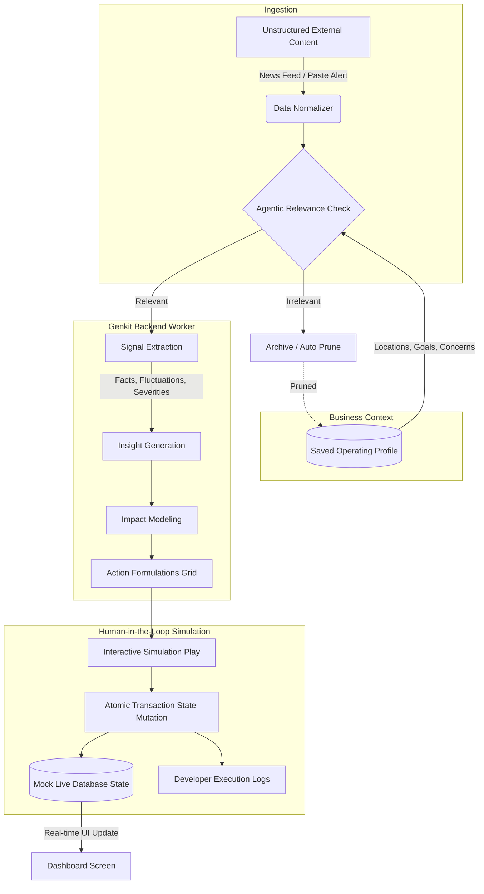
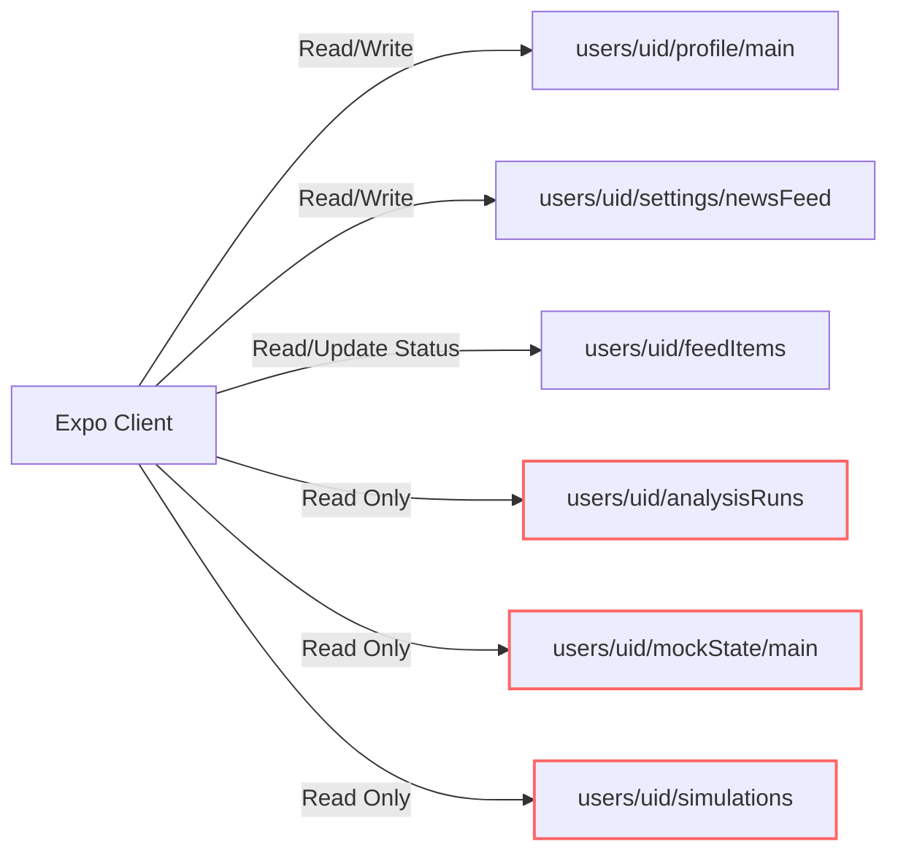

# Relay — Signals into action.

> [!NOTE]
> **Cognitive Kinetic** is the name of the entire end-to-end content-to-action pipeline (encompassing background feed ingestion, agentic parsing, impact reasoning, and transaction simulation). **Relay** is the frontend mobile application interface of this system.

Relay is a state-of-the-art **Content-to-Action Operational System** built with **React Native (Expo SDK 54)** and a **Firebase + Google Genkit** backend. It delivers **operational intelligence for real-time decisions**.

Designed for dispatch, logistics, and operational teams, Relay automatically ingests unstructured external content (e.g., regional news, policy alerts, weather warnings, or fuel spikes), matches it against a persistent, saved business profile, extracts quantitative signals, projects financial and operational impacts, recommends tactical mitigations, and allows operators to interactively simulate actions to transition live database states with complete auditing.

> [!IMPORTANT]
> **Core Product Rule**: Relay is **NOT a chatbot** and **NOT a generic summarization tool**. It is a structured, deterministic decision-making system. It does not use chat bubbles, message threads, or assistant avatars. Instead, it utilizes an operational control panel, before/after metric comparison tables, and terminal-like execution traces.

---

## 🚀 1. The Operational Ingestion-to-Action Pipeline

The entire system is orchestrated around a strict, unidirectional pipeline:



### The Primary Value Proposition
- **Persistent Context Onboarding**: The business enters its profile (operating locations, concerns, goals, risk tolerance) exactly once. This profile is securely loaded by the backend for all future runs.
- **Signal vs. Summary**: Instead of generating a passive summary block, Relay extracts precise, quantitative metrics (e.g., `+12% fuel variance`, `Lahore Mall Road restriction`) and constructs actionable risk matrices.
- **Interactive State Simulation**: The app features a live, mockable operational system database (e.g., base fees, surcharges, dispatch corridors). Operators can click a recommended action to run a transaction on the backend, checking the before/after state metrics alongside real technical execution logs.

---

## 📂 2. Repository Directory Structure

The repository is structured to separate front-end client rendering from trusted back-end agent execution:

```text
CognitiveKinetic/
├── .agent/                  # Developer agent workspace files & workflows
├── assets/                  # Brand assets, static mocks, and media
├── docs/                    # Architectural deep dives & design specs
│   ├── backend-arch.md      # Backend specifications
│   ├── design.md            # Interactive design systems
│   └── frontend-arch.md     # Client capabilities
├── firestore.rules          # Production Firestore security boundaries
├── firestore.indexes.json   # Composite indexing for high-performance queries
├── firebase.json            # Firebase emulators & services setup
├── package.json             # Root mobile development configuration
├── App.js                   # Mobile application root entryway
├── index.js                 # AppRegistry bootstrapping
├── src/                     # Mobile Frontend Source (React Native / Expo)
│   ├── components/          # Reusable UI elements (Glass cards, metric grids)
│   ├── constants/           # HSL color swatches & dynamic styles
│   ├── context/             # Global states (Auth, Preferences, AnalysisContext)
│   ├── data/                # Static mock assets & scenarios
│   ├── hooks/               # Custom hooks (usePreferences, useAnalysis)
│   ├── navigation/          # React Navigation tabs & screens setup
│   ├── screens/             # UI Screens (Dashboard, Simulation, Settings)
│   │   ├── auth/            # Login, Signup, Forgot Password screens
│   │   └── ...              # Screen components
│   ├── services/            # API Service Layer
│   │   ├── firebase.js      # JS SDK bootstrap
│   │   └── ...              # Services & Mock systems
│   └── utils/               # Time formatters, content parsers
└── functions/               # Backend Server Source (NodeJS / TypeScript)
    ├── package.json         # Node runtime configurations & engines
    ├── tsconfig.json        # TypeScript compilation configurations
    └── src/                 # Cloud Trigger & Agent Worker Scripts
        ├── index.ts         # Main Cloud Function exports
        ├── agentWorker.ts   # Google Genkit + Gemini Pipeline processing
        ├── createAnalysisRun.ts # Analysis initiator enqueuing Tasks
        ├── simulateAction.ts # Atomic state transaction & logger
        ├── ingestNewsTick.ts # Cron ingestion scheduling & agent filtering
        └── constants/       # Ingestion endpoints & type contracts
```

---

## ⚙️ 3. Backend Architecture & Agentic Flow (Deep Dive)

Trusted business reasoning and API keys are strictly kept on the Firebase backend to prevent client-side security leaks. The backend consists of four primary triggers and execution blocks:

### 3.1 scheduled Ingestion Feed (`ingestNewsTick`)
A scheduled chron trigger that fetches regional and operational news, scoring relevance in the background:
- **Frequency**: Runs every 12 hours (scheduled via `onSchedule("every 12 hours")`).
- **Target Ingestion Sources**: Pulls unstructured articles and alerts from **GDELT Project**, **Google News RSS**, **Reddit Operational subreddits**, and regional outlets.
- **Relevance Scoring & Filtering**: Articles are scored by a light LLM evaluator against the saved business context profile (`users/{uid}/profile/main`).
- **Lifecycle Auditing**: Unread, idle feed items are archived after 2 days to maintain feed cleanliness. Archived items are automatically deleted after 31 days to optimize Firestore storage.

### 3.2 Analysis Ingestion gateway (`createAnalysisRun`)
When an operator pastes custom content or selects an item from the news feed:
1. **Verification**: Verifies the Firebase Auth token and validates that content size is under 50,000 characters.
2. **Context Binding**: Loads the user's saved operating profile from Firestore. If none exists, rejects the call.
3. **Durable State Writing**: Transactionally creates an `analysisRuns/{runId}` document with `status: "queued"` and writes an audit log under the runs subcollection.
4. **Cloud Task Enqueuing**: Enqueues a heavy job onto the `agentWorker` queue, passing `runId` and `uid`, protecting the HTTP gateway from timeouts.

### 3.3 Asynchronous Agent Processing (`agentWorker`)
Leverages **Google Genkit (v1.29)** and **Gemini 2.5 Flash** to perform structured reasoning across 5 distinct pipeline stages:

| Stage | Name | Target Operations |
|---|---|---|
| 1 | `extract_signals` | Analyzes unstructured text to extract facts, numeric variables, dates, and locations. |
| 2 | `check_relevance` | Validates signals against the user's concerns, locations, and sensitivity profile. |
| 3 | `generate_insights` | Translates raw signals into tactical business indicators (e.g. margin compressions). |
| 4 | `analyze_impact` | Formulates immediate short-term and projected medium-term operational and compliance risks. |
| 5 | `recommend_actions` | Plans concrete, practical actions matching a strict JSON schema: `actionType: "pricing_adjust" \| "route_shift" \| "manual_review"`. |

### 3.4 Stateful Action Sandbox Simulator (`simulateAction`)
Unlike fake demo buttons that do not change state, Relay runs an atomic transaction on the backend:
- Reads the current live mock database state under `users/{uid}/mockState/main`.
- Validates the selected `actionId` within the associated `analysisRuns/{runId}`.
- Transactionally mutates mock pricing metrics or routing surcharges on `mockState/main` (e.g., sets long-distance surcharge, shifts peak hours).
- Appends execution logs mimicking live system configurations, REST responses, and SQL logs.
- Writes a permanent diagnostic record under `users/{uid}/simulations/{simId}`.
- Updates the action's status within `analysisRuns/{runId}` to `simulationStatus: "passed"` or `"failed"`.

---

## 📱 4. Frontend UI/UX Architecture & Screens

Relay features a premium, developer-focused **Technical Glassmorphism** interface. It leverages sleek, translucent cards, uniform HSL colors, 2px line Feather icons, and dynamic transitions.

### Swappable HSL Theme Palettes
Users can dynamically update the entire app's visual spectrum from **Profile Settings** to match their style:
- 🔥 **Ember Carbon**: Matte dark grey backdrop with high-contrast crimson and orange indicators.
- 🥉 **Graphite Copper**: Deep charcoal canvas accented with premium copper, amber, and gold highlights.
- 🌲 **Forest Moss**: Dark obsidian base with muted moss greens, emeralds, and soft teal telemetry.

### The 11 Required App Screens
The mobile application fully supports and structures the following views:

1. **Login & SignUp Screens (`src/screens/auth/`)**: Secure user onboarding utilizing Firebase Authentication.
2. **One-Time Profile Setup (`src/screens/OnboardingScreen.js`)**: Initial setup form for business operating context (locations, risk, concerns).
3. **Main Dashboard (`src/screens/DashboardScreen.js`)**: The core control panel. Displays active profile summaries, recent analyzed content cards, pending operational actions, mock database statuses, and live execution logs.
4. **New Content Input (`src/screens/NewContentScreen.js`)**: Allows pasting raw reports, market updates, or manually entering logistics tickers to trigger analysis.
5. **Multi-Source Ingestion Feed (`src/screens/NewContentScreen.js` - Feed tab)**: Browse scored regional news articles fetched by scheduled workers.
6. **Analysis Progress Tracking (`src/screens/AnalysisRunScreen.js`)**: Shows real-time, step-by-step progress tickers (loading profile, checking relevance, extracting signals, modeling impact, planning actions).
7. **Insight & Impact Report (`src/screens/ImpactReportScreen.js`)**: Displays the final structured analysis card including extracted quantitative facts, relevance scores, severity scales, and risk factors.
8. **Recommended Actions Grid (`src/screens/ActionsScreen.js`)**: Lists planned actions categorized by urgency.
9. **Interactive Action Simulation Sandbox (`src/screens/SimulationResultScreen.js`)**: Side-by-side metric grid showing exact state metrics (Before vs. After) after running simulated decisions.
10. **Technical Execution Trace Logs (`src/screens/AgentTraceScreen.js`)**: Terminal-like diagnostic system logs detailing backend API payload schemas and database updates.
11. **Profile Settings (`src/screens/ProfileSettingsScreen.js`)**: Modify active operating concerns, locations, goals, and swap UI theme colors.

---

## 🔒 5. Robust Security Boundaries & Database Rules

Data isolation is guaranteed through strict Firestore Security Rules (`firestore.rules`). The client is treated as untrusted, and all critical agent variables are locked down:



### Key Security Safeguards
1. **User Data Isolation**: Rules verify `request.auth.uid == userId` for every collection read or write under `users/{userId}`.
2. **Client Mutation Locks**: Collections containing model-generated analyses (`analysisRuns`), live systems (`mockState`), and simulated logs (`simulations`) have `allow write: if false;` rules. Writes are completely restricted to the Firebase Admin SDK running on Cloud Functions.
3. **News Feed Integrity**: The client is prohibited from editing relevance scores, selection reasons, or source URLs on news items (`feedItems`). The client can only update status variables (e.g. mark as `read`/`saved` or dismiss/delete).
4. **Field Type Validation**: Strict validation schemas enforce max character counts (e.g., email under 320, profile names under 160) and verify field arrays directly in Firestore rules before processing.

---

## 🛠️ 6. Installation, Local Setup & Execution Guide

Follow these steps to set up both the mobile frontend and the Firebase backend locally for complete offline emulation:

### 6.1 Prerequisites
- [Node.js](https://nodejs.org/) (v18+ recommended)
- [Firebase CLI](https://firebase.google.com/docs/cli) (`npm install -g firebase-tools`)
- [Expo Go](https://expo.dev/client) app installed on your physical testing device

### 6.2 Step-by-Step Backend Setup
1. **Enter Functions Directory**:
   ```bash
   cd functions
   ```
2. **Install Node Dependencies**:
   ```bash
   npm install
   ```
3. **Configure Environment Variables**:
   Create a `.env` file in the root workspace to supply Expo variables:
   ```bash
   cp .env.example .env
   ```
   Add a Gemini API credential to your shell environment to let the local Genkit emulator run AI queries:
   ```bash
   export GEMINI_API_KEY="your_actual_gemini_api_key_here"
   ```
4. **Build TypeScript and Start Firebase Emulators**:
   Compile the TypeScript backend files and launch the full Firestore + Functions emulator suite:
   ```bash
   npm run build
   # Start emulators (Firestore, Functions, Tasks, Scheduler)
   firebase emulators:start
   ```

### 6.3 Step-by-Step Frontend Setup
1. **Enter Root Project Workspace**:
   ```bash
   cd ..
   ```
2. **Install Mobile App Dependencies**:
   ```bash
   npm install
   ```
3. **Launch the Metro Bundler**:
   Start the local Expo development bundler:
   ```bash
   npm start
   ```
4. **Running the App**:
   - Press **`w`** to view in a Google Chrome or local web browser.
   - Press **`a`** to spin up an active Android Emulator.
   - Press **`i`** to trigger an iOS Simulator.
   - Scan the terminal's **QR Code** using your physical device's camera (iOS) or the **Expo Go** application (Android) to test immediately with live reload.

---

## 📖 7. Concrete Demo Operating Scenarios

Relay comes equipped with structured, out-of-the-box business scenarios to demonstrate end-to-end signal resolution:

### Scenario A: Sudden Fuel Price Adjustment
- **Persistent Saved Profile**:
  - *Business Name*: Apex Express
  - *Locations*: Lahore, Karachi, Islamabad
  - *Key Concerns*: Fuel costs, Delivery margins, Customer churn
  - *Risk Sensitivity*: High
- **Ingested Raw Article**:
  - *"Ministry of Energy announced a sudden 12% hike in base fuel and diesel prices, effective immediately."*
- **Signal Extraction & Relevance**:
  - *Relevance*: `95%` (Matches concern "fuel costs" and location parameters)
  - *Signals*: `12% fuel hike`, `effective immediately`
- **Insight & Impact Modeling**:
  - *Insight*: Core vehicle corridors in Lahore & Karachi will experience margin compressions of Rs. 18-22 per delivery trip.
  - *Impact*: Low short-term profitability; risk of fleet service disruptions.
- **Recommended Actions**:
  1. *Action A*: Implement Long-Distance Surcharge (+Rs. 20) (Simulation Supported)
  2. *Action B*: Audit current fleet provider logistics configurations.
- **Simulation Sandbox State Transitions**:
  ```text
  [Before State]
  - Base Delivery Fee: Rs. 100
  - Long-Distance Surcharge: Rs. 0
  - Peak-Hour Surcharge: Rs. 15
  - Live Database Status: "System Synced"

  [Simulation Action Trigged] -> Calling backend simulateAction(runId, actionId)

  [After State]
  - Base Delivery Fee: Rs. 100
  - Long-Distance Surcharge: Rs. 20
  - Peak-Hour Surcharge: Rs. 15
  - Live Database Status: "Surcharge Active (+Rs. 20)"
  ```
- **Technical Developer Trace Logs**:
  ```text
  [02:35:10] API Request: POST /api/v1/config/pricing-rules
  [02:35:11] Payload: { rule: "long_distance_surcharge", value: 20, active: true }
  [02:35:11] Response Status: 200 OK
  [02:35:12] Database Write: Table [PricingRules] updated row [long_distance] with value [20]
  [02:35:12] Event Broadcast: PRICING_UPDATED_BROADCAST dispatched to 14 active mobile terminals.
  ```

---

### Scenario B: Environmental Route Restrictions (Smog Ban)
- **Persistent Saved Profile**:
  - *Business Name*: GreenCourier Regional
  - *Locations*: Lahore
  - *Key Concerns*: Route access, Fleet availability
  - *Risk Sensitivity*: Balanced
- **Ingested Raw Article**:
  - *"Commercial vehicle daytime restrictions on Mall Road Lahore due to severe environmental smog index control."*
- **Signal Extraction & Relevance**:
  - *Relevance*: `88%` (Direct location match "Lahore" and threat to "route access")
  - *Signals*: `Daytime restriction`, `Mall Road Lahore`, `Environmental control`
- **Insight & Impact Modeling**:
  - *Insight*: Main route blocked for peak logistics hours. Dispatch gridlocks expected on alternative corridors.
  - *Impact*: Delayed SLA times, increased driver fatigue.
- **Recommended Actions**:
  1. *Action A*: Canal Road Rerouting & Peak Surcharge (+Rs. 30) (Simulation Supported)
  2. *Action B*: Issue automated driver routes configuration audit.
- **Simulation Sandbox State Transitions**:
  ```text
  [Before State]
  - Peak-Hour Surcharge: Rs. 15
  - Active Dispatch Zone: "Mall Road Corridor"
  - Live Database Status: "System Synced"

  [Simulation Action Trigged] -> Calling backend simulateAction(runId, actionId)

  [After State]
  - Peak-Hour Surcharge: Rs. 30
  - Active Dispatch Zone: "Canal Road Reroute"
  - Live Database Status: "Peak Adjustment Active (+Rs. 30)"
  ```
- **Technical Developer Trace Logs**:
  ```text
  [05:12:01] API Request: POST /api/v1/routes/optimizer
  [05:12:02] Payload: { avoidZone: 'Mall Road Lahore', shiftWindows: ['08:00', '20:00'] }
  [05:12:02] Response Status: 200 OK
  [05:12:03] AI Routing Engine: Routing graph successfully reconstructed to re-route 14 vehicles.
  [05:12:04] Database Write: Table [PeakSurcharges] updated buffer value to [30]
  [05:12:04] Broadcast Dispatched: DISPATCH_REROUTE_ALERT transmitted to regional driver terminals.
  ```

---

## 📄 8. License & Development Principles

This repository belongs to the Relay operational intelligence portfolio. Developers committing changes must maintain a strict decoupling of UI renders (`src/screens`) from model scoring and transaction APIs (`functions/`). All security rules must be validated against `firestore-rules-audit.md` before updates are pushed to production instances.
