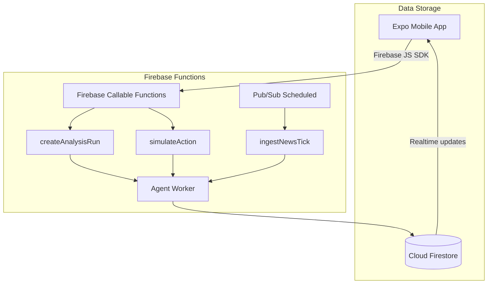

# Cognitive Kinetic Backend Service Architecture

This document defines the required backend architecture for **Cognitive Kinetic**, the end-to-end content-to-action backend service and pipeline. The mobile application that serves as the frontend interface for this system is named **Relay**.

Cognitive Kinetic is not a chatbot. It is a profile-driven content-to-action system:

```text
saved profile
  -> new content or fetched news
  -> relevance check
  -> signal extraction
  -> insight generation
  -> impact analysis
  -> recommended action
  -> simulation
  -> updated report/dashboard
```

The backend must move trusted execution out of the Expo client. The mobile app should only authenticate the user, collect input, display realtime state, and call backend APIs. The backend owns profile loading, content ingestion, news aggregation, analysis, simulation, logs, and report state.

---

## 1. Current App Baseline

The current app is already a good Firebase-first candidate.

Known baseline:

- React Native app built with Expo SDK 54.
- Firebase JS SDK is already used in the app.
- Existing Firebase entry point: `src/services/firebase.js`.
- Existing profile persistence: `src/services/profileService.js`.
- Existing local agent modules: `src/services/agent/orchestrator.js`, `planner.js`, and `tracer.js`.
- Existing Firestore rules already scope basic user profile and analysis paths to authenticated owners.

The migration should not replace the frontend. It should replace the trusted local agent execution with backend-owned execution.

---

## 2. Current Architecture

The backend utilizes a Firebase-first architecture using Firebase Functions for both API exposure and executing background logic.



The app-facing API is exposed via Firebase Callable Functions. The agent logic and pipeline run within the same Node.js environment in Cloud Functions, communicating directly with Firestore as the realtime product state store. Periodic news ingestion is triggered by Cloud Scheduler through Pub/Sub.

---

## 3. Architecture Rules

These rules are non-negotiable for the implementation.

1. The client never sends trusted profile context for analysis.
2. The backend always loads `users/{uid}/profile/main` itself.
3. The client never calls news providers directly.
4. The client never holds model keys, provider API keys, service account keys, or source credentials.
5. Model output is never directly executed.
6. Only backend-whitelisted simulation handlers can mutate simulation state.
7. Every analysis run is represented by a durable Firestore document before heavy work starts.
8. Every long-running worker must be idempotent because Cloud Tasks can retry.
9. Firestore documents under `users/{uid}` must only be readable/writable by that authenticated user, except backend Admin SDK writes.
10. Backend-generated fields such as `signals`, `impact`, `recommendedActions`, logs, simulations, and report summaries must not be writable by the client.

---

## 4. MVP vs Production Execution

### 4.1 MVP Execution

The first backend milestone should be small.

```text
Expo app
  -> callable createAnalysisRun
  -> Firestore analysisRuns/{runId}
  -> app listens with onSnapshot
```

For the first implementation, `createAnalysisRun` should only:

1. verify Firebase Auth
2. validate `content`
3. load `users/{uid}/profile/main`
4. reject if no profile exists
5. create `users/{uid}/contentItems/{contentId}`
6. create `users/{uid}/analysisRuns/{runId}` with `status: queued`
7. write one initial log
8. return `{ runId }`

Do not add Gemini, Cloud Run, Cloud Tasks, or news ingestion until this works.

### 4.2 Production Execution

Production uses callable functions only as the gateway.

```text
createAnalysisRun callable
  -> verify auth
  -> validate input
  -> load saved profile
  -> create content item
  -> create queued analysis run
  -> enqueue Cloud Task { uid, runId, idempotencyKey }
  -> return runId

Cloud Run /tasks/analyze
  -> verify IAM/OIDC
  -> transactionally claim queued run
  -> load profile + content
  -> execute pipeline stages
  -> validate model output
  -> write signals/insights/impact/actions
  -> auto-simulate top supported action or mark needs_simulation
  -> update dashboard summary
```

---

## 5. Backend Services

The backend should be split into clear services.

```text
functions/
├── src/
│   ├── index.ts                  # Main entry point exporting all functions
│   ├── createAnalysisRun.ts      # Callable: Initiates analysis process
│   ├── simulateAction.ts         # Callable: Simulates recommended actions
│   ├── ingestNewsTick.ts         # PubSub/Scheduled: Fetches latest news
│   ├── agentWorker.ts            # Logic for content-to-action pipeline
│   └── constants/                # Shared constants
│       ├── sources.ts            # Defined news sources
│       └── types.ts              # TypeScript interfaces
```

The existing mobile services remain, but they use thin API clients instead of owning trusted agent logic.

Recommended mobile API clients:
```text
src/services/
├── ingestion.js
├── actions.js
├── simulation.js
├── profileService.js
└── understanding.js
```

---

## 6. Public Callable Endpoints

These endpoints are exposed via Firebase Callable Functions and can be called directly by the Expo app.

### `createAnalysisRun`

Starts analysis for pasted content or an existing content item.

Responsibilities:
- Requires authentication
- Loads saved profile from Firestore (`users/{uid}/profile/main`)
- Fails with `failed-precondition` if profile does not exist
- Creates a new `contentItems` entry from the provided text
- Creates `analysisRuns/{runId}` with `status: running`
- Initializes `logs` collection for the run
- Runs the agent worker pipeline synchronously (in the current MVP)
- Extracts signals, checks relevance, generates insights, and plans actions
- Updates the analysis run status to `completed`
- Returns `{ runId }`

### `simulateAction`

Simulates a recommended action against the mock state.

Responsibilities:
- Requires authentication
- Validates the requested `actionId`
- Updates the action's status to `simulated` in the analysis run
- Adds an execution log to the analysis run
- Returns a hardcoded or mock simulation result representing the before and after state

---

## 7. Scheduled Background Functions

These functions are triggered automatically by the system infrastructure.

### `ingestNewsTick`

A scheduled function (Pub/Sub) that periodically aggregates external news content.

Responsibilities:
- Triggered on a schedule (e.g., via Cloud Scheduler)
- Fetches external content from defined sources (currently mock sources in `sources.ts`)
- Stores normalized feed items in the global `feedItems` collection for users to discover and analyze

---

## 8. News Aggregation Architecture

News aggregation is backend-owned.

The mobile app does not fetch RSS feeds, call NewsAPI/GDELT directly, hold source credentials, scrape webpages, or ship hardcoded news records. The mobile app only reads cached Firestore feed state and asks the backend to refresh when needed.

### 8.1 Feed Flow

```text
Cloud Scheduler every 6 hours
  -> Pub/Sub topic: feed-refresh
  -> Cloud Run /tasks/fetch-source for each enabled source
  -> normalize article
  -> deduplicate
  -> upsert global feedItems/{feedItemId}
  -> project relevant items into users/{uid}/feedItems/{feedItemId}
  -> Expo app reads user feed from Firestore
```

Manual refresh uses the same backend pipeline:

```text
FeedScreen pull-to-refresh
  -> callable refreshContentFeed
  -> auth + throttle
  -> if cache fresh: return immediately
  -> else enqueue source fetch/projection jobs
  -> Firestore feed listeners update UI
```

### 8.2 Global Feed vs User Feed

There must be two feed layers.

Global article cache:

```text
feedItems/{feedItemId}
```

This stores public article/source data once.

User-specific feed projection:

```text
users/{uid}/feedItems/{feedItemId}
```

This stores only user-specific relevance and state.

Do not duplicate full article bodies under every user.

### 8.3 Relevance Projection Is Not Full Analysis

The feed projection step should be cheap and deterministic in the MVP.

It can use:

- topic keyword match
- source region match
- saved profile location match
- saved profile concern match
- freshness score
- source subscription preferences

It should not call Gemini for every article/user pair in the first version. Full agent analysis starts only when the user taps `Analyze` on a feed item.

### 8.4 Initial News Sources

Start simple.

Recommended first sources:

```text
RSS feeds from selected Pakistani business/news outlets
GDELT query source for public news discovery
optional NewsAPI/NewsData provider later
```

The source system must be adapter-based so provider-specific code does not leak into the app.

```text
rssAdapter
  -> parse feed XML
  -> normalize article fields

gdeltAdapter
  -> fetch public query result
  -> normalize article fields

newsApiAdapter
  -> fetch provider JSON
  -> normalize article fields
```

### 8.5 News Deduplication

Deduplication order:

1. canonical URL
2. provider article ID
3. normalized title + source + published date hash
4. normalized title/body hash fallback

Recommended hash:

```text
sha256(lowercase(trim(title)) + canonicalHost + yyyy-mm-dd(publishedAt))
```

### 8.6 Feed Item Statuses

Global feed item status:

```text
active | archived | failed_parse | duplicate
```

User feed item status:

```text
new | saved | dismissed | analyzed | ignored
```

A dismissed item should disappear only for that user. It should not modify the global feed item.

---

## 9. Firestore Data Model

Firestore stores durable product state. React state and AsyncStorage can store temporary UI state only.

### 9.1 Collection Tree

```text
users/{uid}
users/{uid}/profile/main
users/{uid}/profileVersions/{versionId}
users/{uid}/contentItems/{contentId}
users/{uid}/analysisRuns/{runId}
users/{uid}/analysisRuns/{runId}/logs/{logId}
users/{uid}/analysisRuns/{runId}/stageEvents/{eventId}
users/{uid}/analysisRuns/{runId}/actions/{actionId}
users/{uid}/simulations/{simulationId}
users/{uid}/simulationState/main
users/{uid}/simulationStateHistory/{eventId}
users/{uid}/actionQueue/{actionId}
users/{uid}/feedItems/{feedItemId}
users/{uid}/sourceSubscriptions/{sourceId}
users/{uid}/dashboard/main
users/{uid}/exports/{exportId}

feedItems/{feedItemId}
sourceConfigs/{sourceId}
sourceFetchRuns/{runId}
systemLogs/{logId}
```

### 9.2 `users/{uid}/profile/main`

```json
{
  "businessName": "Apex Delivery",
  "domain": "delivery business",
  "industry": "logistics",
  "operatingLocations": ["Lahore", "Karachi", "Islamabad"],
  "keyConcerns": ["fuel costs", "delivery margins", "customer churn"],
  "goals": ["protect margins", "reduce churn"],
  "constraints": ["avoid broad fee increases"],
  "riskSensitivity": "high",
  "defaultCurrency": "PKR",
  "profileVersion": 1,
  "status": "active",
  "createdAt": "server timestamp",
  "updatedAt": "server timestamp"
}
```

Rules:

- Created once during onboarding.
- Updated only from Profile Settings.
- Loaded automatically by backend for every analysis.
- Snapshotted into each analysis run.

### 9.3 `users/{uid}/contentItems/{contentId}`

```json
{
  "sourceType": "pasted_text | upload | feed_item | url | api",
  "sourceName": "Manual Input",
  "sourceKey": "manual | rss_dawn | gdelt | newsapi",
  "feedItemId": null,
  "title": "Fuel price update",
  "rawText": "Fuel prices increased by 12% effective immediately.",
  "sourceUrl": null,
  "storagePath": null,
  "normalizedTextHash": "sha256",
  "contentLength": 58,
  "detectedTopics": ["fuel", "logistics"],
  "parserStatus": "ready | parsing | failed",
  "analysisStatus": "new | queued | analyzed | ignored | failed",
  "latestRunId": null,
  "createdAt": "server timestamp",
  "createdBy": "uid"
}
```

Important: do not store only the first 500 characters if the content will be analyzed later. Store full small text in `contentItems.rawText`, or store large text/files in Cloud Storage and keep `storagePath` plus snippets in Firestore.

### 9.4 `users/{uid}/analysisRuns/{runId}`

```json
{
  "status": "queued | running | needs_simulation | simulating | simulated | ignored | failed",
  "currentStage": "load_profile | ingest_content | extract_signals | check_relevance | generate_insight | analyze_impact | plan_actions | simulate_action | update_report",
  "stageIndex": 0,
  "profileVersion": 1,
  "profileSnapshot": {},
  "contentRefs": ["contentId"],
  "sourceSnapshot": {
    "sourceType": "pasted_text | feed_item | upload | url | api",
    "sourceName": "Manual Input",
    "title": "Fuel price update",
    "sourceUrl": null
  },
  "signals": [],
  "relevance": null,
  "insights": [],
  "impact": null,
  "selectedActionId": null,
  "simulationId": null,
  "simulationResult": null,
  "reportSummary": null,
  "model": {
    "provider": null,
    "modelName": null,
    "promptVersion": null,
    "schemaVersion": "analysis-run-v1"
  },
  "traceId": "trace_abc",
  "idempotencyKey": "uid:contentHash:profileVersion",
  "createdAt": "server timestamp",
  "updatedAt": "server timestamp",
  "completedAt": null,
  "error": null
}
```

Use a subcollection for actions instead of keeping only an array if actions need individual updates.

```text
users/{uid}/analysisRuns/{runId}/actions/{actionId}
```

This avoids rewriting an entire `recommendedActions` array when one action is simulated, dismissed, or completed.

### 9.5 `users/{uid}/analysisRuns/{runId}/actions/{actionId}`

```json
{
  "title": "Increase long-distance delivery fee by Rs. 20",
  "description": "Add a surcharge to offset fuel cost increase.",
  "actionType": "pricing_adjust | route_shift | policy_review",
  "targetSystem": "simulation_pricing_table",
  "urgency": "low | medium | high",
  "confidence": 0.9,
  "expectedEffect": "Raises long-distance delivery fee from Rs. 100 to Rs. 120.",
  "simulationSupported": true,
  "simulationParams": {
    "longDistanceSurchargeDelta": 20
  },
  "status": "pending | accepted | dismissed | simulating | simulated | failed | completed",
  "createdAt": "server timestamp",
  "updatedAt": "server timestamp"
}
```

### 9.6 `users/{uid}/analysisRuns/{runId}/logs/{logId}`

```json
{
  "sequence": 10,
  "stage": "load_profile",
  "level": "info | success | warning | error",
  "message": "Saved profile loaded.",
  "metadata": {},
  "createdAt": "server timestamp"
}
```

Sequence ranges:

```text
10 load_profile
20 ingest_content
30 extract_signals
40 check_relevance
50 generate_insight
60 analyze_impact
70 plan_actions
80 simulate_action
90 update_report
```

### 9.7 `feedItems/{feedItemId}`

Global public/backend-curated article cache.

```json
{
  "sourceType": "news | alert | policy | market | report",
  "sourceKey": "rss_dawn_business",
  "sourceName": "Dawn Business RSS",
  "title": "Fuel prices increased by 12% effective immediately",
  "bodyPreview": "The Ministry of Energy announced...",
  "sourceUrl": "https://example.com/fuel-price-alert",
  "canonicalUrl": "https://example.com/fuel-price-alert",
  "providerArticleId": "provider-id-123",
  "normalizedHash": "sha256",
  "detectedTopics": ["fuel", "logistics"],
  "locations": ["Pakistan"],
  "language": "en",
  "country": "PK",
  "publishedAt": "timestamp",
  "fetchedAt": "server timestamp",
  "createdAt": "server timestamp",
  "status": "active | archived | failed_parse | duplicate"
}
```

No private user data belongs here.

### 9.8 `users/{uid}/feedItems/{feedItemId}`

User-specific feed projection.

```json
{
  "feedItemId": "feed_123",
  "relevanceScore": 82,
  "reason": "Fuel cost matches saved key concern and Pakistan matches operating region.",
  "matchedConcerns": ["fuel costs", "delivery margins"],
  "matchedLocations": ["Pakistan"],
  "status": "new | saved | dismissed | analyzed | ignored",
  "saved": false,
  "latestRunId": null,
  "createdAt": "server timestamp",
  "updatedAt": "server timestamp"
}
```

### 9.9 `sourceConfigs/{sourceId}`

Backend-managed news/source configuration.

```json
{
  "sourceKey": "rss_dawn_business",
  "name": "Dawn Business RSS",
  "type": "rss | gdelt | news_api | custom_http",
  "enabled": true,
  "baseUrl": "https://example.com/rss",
  "regions": ["Pakistan"],
  "defaultTopics": ["fuel", "logistics", "policy", "markets"],
  "refreshEveryHours": 6,
  "secretName": null,
  "lastFetchedAt": "server timestamp",
  "lastStatus": "succeeded | failed",
  "createdAt": "server timestamp",
  "updatedAt": "server timestamp"
}
```

Secrets are never stored here. `secretName` points to Secret Manager.

### 9.10 `sourceFetchRuns/{runId}`

```json
{
  "trigger": "scheduled_6h | user_refresh",
  "requestedBy": "system | uid",
  "sourceIds": ["rss_dawn_business"],
  "status": "running | succeeded | partial | failed",
  "startedAt": "server timestamp",
  "completedAt": "server timestamp",
  "counts": {
    "fetched": 40,
    "created": 12,
    "updated": 6,
    "deduped": 22,
    "failed": 0
  },
  "errors": []
}
```

### 9.11 `users/{uid}/simulationState/main`

```json
{
  "pricing": {
    "baseDeliveryFee": 100,
    "longDistanceSurcharge": 0,
    "peakHourSurcharge": 15,
    "totalFee": 100,
    "currency": "PKR"
  },
  "routing": {
    "activeCorridor": "standard",
    "restrictedZones": [],
    "reroutedVehicles": 0
  },
  "customerComms": {
    "lastDraftId": null,
    "pendingNotifications": 0
  },
  "lastSimulationId": null,
  "updatedAt": "server timestamp"
}
```

### 9.12 `users/{uid}/simulations/{simulationId}`

```json
{
  "runId": "run_123",
  "selectedActionId": "act_long_distance_surcharge_20",
  "actionType": "pricing_adjust",
  "targetSystem": "simulation_pricing_table",
  "status": "succeeded | failed",
  "beforeState": {},
  "afterState": {},
  "changedFields": [
    {
      "path": "pricing.longDistanceSurcharge",
      "before": 0,
      "after": 20
    }
  ],
  "logs": ["action selected", "state changed"],
  "createdAt": "server timestamp",
  "createdBy": "uid"
}
```

---

## 10. Analysis Pipeline

The agent pipeline must be deterministic at the orchestration level and model-assisted only where language understanding is needed.

### Stage Order

```text
load_profile
  -> ingest_content
  -> extract_signals
  -> check_relevance
  -> generate_insight
  -> analyze_impact
  -> plan_actions
  -> simulate_action
  -> update_report
```

### Status State Machine

```text
queued -> running
running -> ignored
running -> needs_simulation
running -> simulating
running -> failed
needs_simulation -> simulating
simulating -> simulated
simulating -> failed
failed -> queued only by explicit retry
ignored -> ignored
simulated -> simulated
```

### Stage Requirements

Each stage must write:

- `analysisRuns/{runId}.currentStage`
- one `stageEvents` document
- one or more user-visible logs
- partial output only after validation

### Low Relevance Behavior

Low relevance should not look like a failed run.

If relevance is below threshold:

```json
{
  "status": "ignored",
  "currentStage": "update_report",
  "relevance": {
    "score": 24,
    "label": "low",
    "reason": "The content does not match saved concerns or operating locations."
  },
  "recommendedActions": []
}
```

The app should show an explicit low-relevance result instead of spinning forever.

---

## 11. Model Use

Use Vertex AI/Gemini from backend only.

Use model calls for:

- semantic signal extraction
- entity/location extraction
- relevance explanation
- insight generation
- impact analysis
- action planning

Use deterministic code for:

- auth
- validation
- profile loading
- Firestore writes
- deduplication
- status transitions
- retry/idempotency
- simulation state mutation
- cost/rate controls

Every model response must be:

1. parsed as JSON
2. validated with a schema library such as Zod
3. checked against allowed enums
4. checked for evidence references
5. rejected or retried if invalid
6. stored with `modelName`, `promptVersion`, and `schemaVersion`

Model output must be rejected if it:

- asks for business context again
- ignores the saved profile
- recommends unknown action types
- recommends arbitrary Firestore paths
- recommends arbitrary URL calls
- recommends code execution
- lacks evidence from the source content

---

## 12. Simulation Architecture

Simulation is backend-owned state mutation, not frontend animation.

Only whitelisted handlers can change simulation state.

Supported initial handlers:

```text
pricing_adjust
route_shift
policy_review
```

### `pricing_adjust`

Reads:

```text
users/{uid}/simulationState/main.pricing
```

Can modify:

```text
pricing.longDistanceSurcharge
pricing.peakHourSurcharge
pricing.totalFee
```

Must write:

```text
users/{uid}/simulations/{simulationId}
users/{uid}/simulationState/main
users/{uid}/simulationStateHistory/{eventId}
analysisRuns/{runId}.simulationResult
analysisRuns/{runId}/actions/{actionId}.status
```

### `route_shift`

Can modify routing simulation fields only.

### `policy_review`

Does not mutate simulation state by default. It creates a manual action queue item.

---

## 13. Firestore Client vs Backend Writes

### Client may write

```text
users/{uid}/profile/main
users/{uid}/contentItems/{contentId} request-safe fields only
users/{uid}/sourceSubscriptions/{sourceId}
```

The client should usually call functions instead of writing analysis or simulation records directly.

### Backend only writes

```text
analysisRuns.signals
analysisRuns.relevance
analysisRuns.insights
analysisRuns.impact
analysisRuns.reportSummary
analysisRuns.status after queued
analysisRuns/{runId}/logs/*
analysisRuns/{runId}/stageEvents/*
analysisRuns/{runId}/actions/* generated fields
simulations/*
simulationState/*
simulationStateHistory/*
actionQueue/*
dashboard/main
feedItems/*
sourceConfigs/*
sourceFetchRuns/*
```

This prevents users from forging reports, actions, or simulation results from the mobile client.

---

## 14. Firestore Indexes

Expected indexes:

```text
users/{uid}/analysisRuns: status ASC, createdAt DESC
users/{uid}/analysisRuns: completedAt DESC
users/{uid}/contentItems: analysisStatus ASC, createdAt DESC
users/{uid}/actionQueue: status ASC, urgency ASC, createdAt DESC
users/{uid}/simulations: runId ASC, createdAt DESC
users/{uid}/feedItems: status ASC, relevanceScore DESC, createdAt DESC
users/{uid}/feedItems: saved ASC, createdAt DESC
feedItems: status ASC, publishedAt DESC
feedItems: sourceKey ASC, status ASC, publishedAt DESC
feedItems: status ASC, detectedTopics ARRAY, publishedAt DESC
sourceFetchRuns: status ASC, startedAt DESC
```

---

## 15. Security Requirements

### Client Security

- Keep only public Firebase config in `EXPO_PUBLIC_*`.
- Never store backend secrets in Expo environment variables.
- Add Firebase Auth persistence with AsyncStorage.
- Enable App Check before production.

### Callable Function Security

- Require `request.auth` on every callable.
- Use `HttpsError` codes, not raw HTTP status logic.
- Validate input shape and length.
- Add per-user analysis and refresh limits.
- Never trust `uid`, `profile`, or backend-owned fields sent by the client.

### Cloud Run Security

- Deploy with `--no-allow-unauthenticated`.
- Use IAM/OIDC from Cloud Tasks.
- Use a dedicated service account.
- Grant least privilege roles only.
- Do not expose `/tasks/*` publicly.

### Firestore Rules

Rules must enforce:

- users read only their own user documents
- users cannot write backend-generated analysis outputs
- users cannot write global feed items
- users cannot write source configs
- users cannot write simulation state directly
- users can only update safe preference/status fields on their own feed/action docs

### Secret Manager

Store:

- source provider API keys
- webhook secrets
- model/provider configuration that should not be public
- any future email/provider tokens

Do not store secret values in Firestore.

---

## 16. Cloud Setup

### Firebase Functions

Use Functions v2 and TypeScript.

Recommended runtime:

```json
{
  "engines": {
    "node": "22"
  }
}
```

Node 20 is also acceptable if you want the more conservative runtime.

### Cloud Tasks

Queue for user-triggered analysis:

```bash
#gcloud tasks queues create analysis-runs \
#  --location us-central1 \
#  --max-dispatches-per-second 5 \
#  --max-concurrent-dispatches 10
```

Handlers must be idempotent.

### Cloud Scheduler and Pub/Sub

Scheduled feed refresh:

```text
Cloud Scheduler: every 6 hours
  -> Pub/Sub topic: feed-refresh
  -> Cloud Run fetch-source tasks
```

Manual refresh should reuse the same pipeline but apply per-user throttle.

### Cloud Run Worker

Deploy as private.

Required APIs:

```text
run.googleapis.com
cloudbuild.googleapis.com
aiplatform.googleapis.com
secretmanager.googleapis.com
cloudtasks.googleapis.com
pubsub.googleapis.com
```

Required worker roles:

```text
roles/datastore.user
roles/aiplatform.user
roles/secretmanager.secretAccessor
```

The Cloud Tasks caller service account needs:

```text
roles/run.invoker
```

---

## 17. Mobile Integration Flow

### Dashboard

```text
login
  -> observe users/{uid}/profile/main
  -> if missing: onboarding
  -> if exists: dashboard
  -> observe users/{uid}/dashboard/main
  -> observe latest analysisRuns
  -> observe actionQueue
  -> observe recent simulations
```

### New Content

```text
user pastes content
  -> createAnalysisRun({ content })
  -> receive runId
  -> navigate to AnalysisProgress(runId)
  -> listen to analysisRuns/{runId}
  -> listen to logs
```

### Feed

```text
FeedScreen
  -> listen to users/{uid}/feedItems where status != dismissed
  -> load corresponding global feedItems
  -> user taps save/dismiss/analyze
```

### Analyze Feed Item

```text
user taps Analyze
  -> analyzeFeedItem({ feedItemId })
  -> backend creates content item + analysis run
  -> app navigates to progress screen
```

### Simulation

```text
user taps Simulate
  -> simulateAction({ runId, actionId })
  -> backend mutates simulation state transactionally
  -> app observes simulation result
```

---

## 18. Testing Requirements

Backend tests must cover:

- profile required before analysis
- `createAnalysisRun` rejects unauthenticated users
- `createAnalysisRun` rejects empty/oversized content
- full content is stored in `contentItems`, not only preview text
- analysis run starts as `queued`
- initial log is written
- Cloud Task retry does not duplicate completed work
- low relevance becomes `ignored`, not `failed`
- high relevance fuel example generates pricing action
- simulation changes pricing from Rs. 100 to Rs. 120
- feed source fetch deduplicates repeated articles
- user feed projection writes only relevant user metadata
- dismissed feed item disappears only for that user
- Firestore rules block cross-user reads/writes
- client cannot write backend-generated fields

Use:

```text
Firebase Emulator Suite
unit tests for pipeline stages
integration tests for callable functions
golden JSON fixtures for known scenarios
```

---

## 19. Observability

Track:

- analysis runs created
- analysis runs completed
- failed runs by stage
- ignored runs by relevance score
- model call latency
- token/input size estimate
- model cost estimate
- Cloud Task retries
- simulation success/failure
- feed fetch latency
- feed fetch failure rate
- dedupe counts
- user refresh throttling

Each analysis run should include:

```text
runId
uid
traceId
profileVersion
promptVersion
schemaVersion
modelName
createdAt
completedAt
```

User-visible logs belong in Firestore. Engineering logs belong in Cloud Logging. Do not put raw private content in logs.

---

## 20. Implementation Roadmap

### Phase 1: First Backend Slice

Goal: prove backend callable + Firestore run creation.

Build:

1. Firebase Functions project
2. `createAnalysisRun` callable
3. `contentItems` write
4. `analysisRuns` write
5. first log write
6. client call from New Content screen
7. Firestore listener on Analysis Progress screen

Stop here until it works.

### Phase 2: MVP Analysis Pipeline

Goal: move local deterministic pipeline to backend.

Build:

1. deterministic signal extraction
2. deterministic relevance scoring
3. simple insight/impact/action generation
4. `pricing_adjust` simulation handler
5. report summary update
6. dashboard state update

No Gemini required yet.

### Phase 3: News Feed MVP

Goal: backend-owned news feed without AI scoring.

Build:

1. `sourceConfigs`
2. RSS adapter
3. scheduled `ingestNewsTick` or Cloud Run `/tasks/fetch-source`
4. normalize articles
5. dedupe articles
6. write global `feedItems`
7. deterministic user feed projection
8. feed screen listener
9. save/dismiss/analyze feed item callables

### Phase 4: Cloud Run Worker

Goal: production durability.

Build:

1. Cloud Tasks queue
2. private Cloud Run worker
3. `/tasks/analyze`
4. idempotent run claiming
5. worker retries
6. structured logs and trace IDs

### Phase 5: Vertex AI Integration

Goal: model-assisted reasoning.

Build:

1. Vertex client
2. prompt versions
3. JSON schemas
4. Zod validation
5. schema retry logic
6. cost/latency logging

### Phase 6: Production Hardening

Goal: safe launch.

Build:

1. App Check
2. tightened Firestore rules
3. Storage rules
4. rate limits
5. Secret Manager integration
6. Cloud Monitoring alerts
7. retention policy
8. backup/export policy

---

## 21. Key Decisions

- Firebase Auth is the identity layer.
- Firestore is the realtime app state store.
- Callable Functions are the mobile API gateway.
- Cloud Tasks handles retryable user-triggered work.
- Cloud Run handles long-running agent, simulation, and feed worker jobs.
- Cloud Scheduler + Pub/Sub handles scheduled news refresh every 6 hours.
- News ingestion is global; relevance projection is user-specific.
- Full agent analysis starts only when the user explicitly analyzes content/feed items.
- Vertex AI/Gemini is backend-only and schema-validated.
- Simulation is deterministic backend state mutation.
- Secrets never go into Expo variables or Firestore.

---

## 22. Immediate Next Implementation

Do this first:

```text
functions/src/callable/createAnalysisRun.ts
```

Minimum behavior:

```text
auth required
content required
content length <= 50,000
profile must exist
create contentItems/{contentId}
create analysisRuns/{runId}
create logs/{logId}
return runId
```

Expected created structure:

```text
users/{uid}/contentItems/{contentId}
users/{uid}/analysisRuns/{runId}
users/{uid}/analysisRuns/{runId}/logs/{logId}
```

Do not start the news feature before this flow works from the app.
