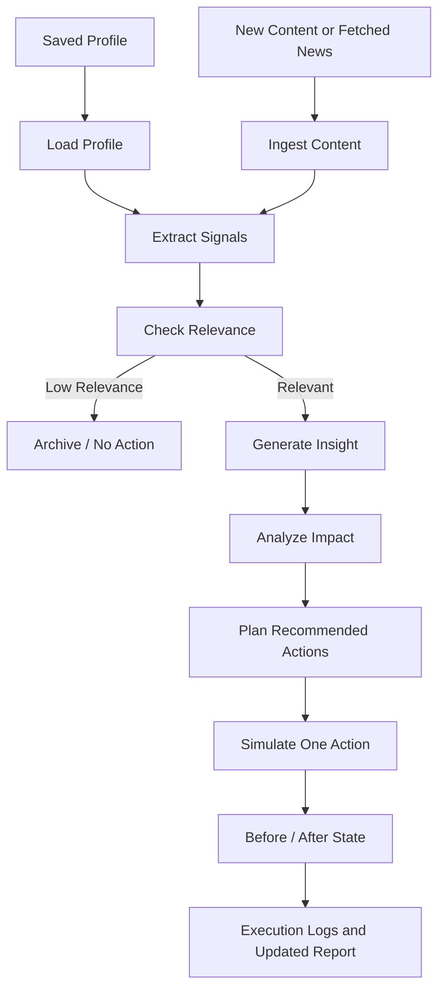

# Relay App: Capabilities and Features

**Cognitive Kinetic** is the entire end-to-end content-to-action pipeline (encompassing background feed ingestion, agentic parsing, impact reasoning, and transaction simulation). **Relay** is the mobile application (built on React Native and Expo SDK 54) that serves as the frontend interface for operators to interact with the Cognitive Kinetic system.

The app is not a chatbot and not a generic summarizer. Its product contract is:

```text
saved profile -> new content/news -> relevance check -> extracted signals -> insight -> impact analysis -> recommended action -> simulated execution -> updated report
```

---

## 1. Core Agentic Pipeline Flow

The core workflow uses structured screens, reports, labels, progress states, and execution timelines instead of chat bubbles.



### Stage-by-Stage Breakdown

1. **Load Profile (`load_profile`)**: Loads the persisted business, organization, or project context. Returning users do not re-enter business context.
2. **Ingest Content (`ingest_content`)**: Normalizes pasted text, uploaded reports, dashboard text, policy updates, market updates, URLs, or selected fetched news.
3. **Extract Signals (`extract_signals`)**: Identifies concrete facts such as price changes, route restrictions, policy deadlines, regional events, demand shifts, or cost pressure.
4. **Check Relevance (`check_relevance`)**: Compares extracted signals with saved profile domain, locations, concerns, goals, constraints, and risk sensitivity.
5. **Generate Insight (`generate_insight`)**: Explains what a relevant signal means for the saved profile.
6. **Analyze Impact (`analyze_impact`)**: Models short-term and medium-term operating, financial, compliance, or customer impact.
7. **Plan Actions (`plan_actions`)**: Produces concrete, practical, simulatable recommendations.
8. **Simulate Action (`simulate_action`)**: Applies one selected or top-ranked supported action to simulation state.
9. **Update Report (`update_report`)**: Writes before/after state, changed fields, status, and execution logs for dashboard/report screens.

---

## 2. News and Content Feed

The feed should be backend-backed and populated from configured news outlets and content providers.

### Feed Capabilities

- Show cached fetched articles, alerts, policy updates, market updates, and source reports.
- Refresh automatically every 6 hours through backend scheduling.
- Refresh on user request when the user refreshes the feed screen.
- Let the user select a fetched item for analysis against the saved profile.
- Show source name, title, preview, detected topics, published time, and fetched time.
- Deduplicate repeated provider payloads before they appear in the app.
- Avoid storing user-specific relevance on global feed records.

### Feed Sources

Configured sources are backend-managed. The app reads safe feed metadata and never stores provider secrets or source API keys.

Supported source types:

- RSS news outlets.
- News provider APIs.
- Policy or regulatory update endpoints.
- Market update APIs.
- Custom HTTP source adapters.

### Refresh Behavior

```text
Scheduled refresh every 6 hours
  -> backend fetches configured outlets
  -> backend normalizes and deduplicates items
  -> app reads updated feed

User refresh
  -> app calls refreshContentFeed
  -> backend validates auth and throttle
  -> backend fetches or returns recent cache
  -> app updates feed list
```

---

## 3. Action Simulation Engine

The Cognitive Kinetic system (accessed via the Relay mobile app) includes a stateful simulation sandbox for supported action types. A simulation button is valid only when it changes state and produces visible before/after output.

### Simulation State

The simulation state can include:

- Pricing rules: base delivery fee, long-distance surcharge, peak-hour surcharge, total fee.
- Routing rules: active corridors, restricted zones, rerouted vehicle count.
- Customer communications: generated drafts or pending notifications.
- Policy review queue: manual-required action records.

### Supported Simulation Handlers

- **Pricing adjustment (`pricing_adjust`)**: Updates a pricing field, recalculates totals, writes changed fields, and records logs.
- **Route shift (`route_shift`)**: Updates routing state, restricted zones, and related operating fees when supported.
- **Policy review (`policy_review`)**: Creates a manual-required queue item when an automated state mutation is not safe.

Each simulation result must include:

- selected action
- before state
- after state
- changed fields
- execution logs
- visible UI result

---

## 4. Core Application Navigation and Screens

The mobile app supports the required content-to-action workflow through structured screens.

### Login / Signup

- Authenticates the user.
- Checks whether `users/{uid}/profile/main` exists.
- Routes first-time users to Profile Setup.
- Routes returning users directly to Dashboard.

### One-Time Profile Setup

- Captures business, organization, project, or operating context once.
- Saves domain, operating locations, concerns, goals, constraints, and risk sensitivity.
- Creates initial simulation state.
- Sends users to Dashboard after completion.

### Main Report / Dashboard

- Shows saved profile summary.
- Makes it clear the saved profile is reused automatically.
- Shows latest impact report.
- Shows recent analyzed content.
- Shows pending recommended actions.
- Shows simulated actions.
- Shows latest execution logs.
- Provides actions to analyze new content, view feed, and update profile settings.

### New Content Input

- Asks only for new content.
- Supports pasted news, reports, dashboard text, policy updates, market updates, uploaded documents, URLs, or selected fetched content.
- Does not ask for business details again.
- Main action should read `Analyze Using Saved Profile`.

### Multi-Source Content Feed

- Lists backend-fetched content from configured outlets.
- Supports manual refresh.
- Shows item source, topic, preview, publish time, and fetch status.
- Allows selecting a feed item for analysis.

### Analysis Progress

- Shows structured stages from profile loading through report update.
- Reads status and logs from the analysis run.
- Handles ignored, failed, queued, running, simulating, and simulated states.

### Insight and Impact Report

- Displays extracted signals.
- Shows relevance score and matched profile factors.
- Shows insight tied to the saved profile.
- Shows impact by risk level, time horizon, affected locations, affected metrics, and assumptions.

### Recommended Actions

- Lists concrete actions with urgency, confidence, expected effect, target system, and simulation support.
- Separates supported simulations from manual-required actions.
- Does not show inert buttons.

### Action Simulation Result

- Shows selected action.
- Shows before/after state comparison.
- Shows changed fields.
- Shows success/failure state.

### Execution Logs

- Shows user-visible stage timeline.
- Includes entries such as profile loaded, content ingested, signal detected, relevance confirmed, impact analyzed, action selected, simulation executed, and state changed.

### Profile Settings

- Allows profile updates after onboarding.
- Increments profile version.
- Does not alter historical report snapshots.

---

## 5. Agent Features

### Profile-Aware Analysis

Every analysis loads the saved profile server-side. New content is treated as untrusted input and cannot override saved business context.

### Signal Extraction

Signals are structured records with evidence, type, metric, location, confidence, and severity. Examples include fuel price changes, route bans, compliance deadlines, market disruptions, demand spikes, and customer-risk signals.

### Relevance Checking

Relevance scoring considers:

- domain match
- location match
- concern match
- goal or constraint match
- metric match
- urgency
- risk sensitivity
- evidence confidence

Low relevance content still gets a clear archived/ignored result so the user knows why no action was recommended.

### Insight Generation

Insights explain why a signal matters for the saved operating context. The app should not stop at summary text.

### Impact Analysis

Impact reports cover short-term effects, medium-term risk, affected locations, affected metrics, assumptions, and risk level.

### Action Planning

Recommended actions must be practical and tied to supported action types. Each action includes title, description, target system, urgency, confidence, expected effect, and simulation support.

### Simulation

At least one relevant action must be simulated. The app should show state transition evidence, not a static recommendation.

### Execution Trace

Each run produces human-readable logs and machine-readable stage events. Logs support dashboard previews, progress screens, reports, and debugging.

---

## 6. Software Architecture Overview

The app should keep UI and agent logic separate. Screens render state; services call backend APIs and subscribe to Firestore.

```text
src/
├── components/          # UI elements (common, settings, simulation, etc.)
├── constants/           # Theme values, colors, brand, and display constants
├── context/             # Auth, profile, analysis, and preferences contexts
├── data/                # Static data and sample inputs
├── navigation/          # React Navigation stacks (Auth, Main, App)
├── screens/             # Native views rendering workflow states
├── services/            # Client service layer
│   ├── actions.js
│   ├── export.js
│   ├── feedService.js
│   ├── firebase.js
│   ├── impact.js
│   ├── ingestion.js
│   ├── insights.js
│   ├── profileService.js
│   ├── simulation.js
│   ├── understanding.js
│   └── agent/           # Local agent orchestration and tracing
├── hooks/               # Custom React hooks (useAgent, useIngestion, useSimulation)
└── utils/               # Formatters, validators, and storage helpers
```

Backend services own trusted execution:

- profile storage
- content ingestion
- source fetching
- feed normalization
- relevance checking
- signal extraction
- insight generation
- impact analysis
- action planning
- action simulation
- execution logs

---

## 7. Data Contracts

### Feed Item

```json
{
  "sourceType": "news | alert | policy | market | report",
  "sourceKey": "rss_dawn",
  "sourceName": "Configured News Outlet",
  "title": "Fuel prices increased by 12% effective immediately",
  "bodyPreview": "The Ministry of Energy announced...",
  "sourceUrl": "https://example.com/fuel-price-alert",
  "canonicalUrl": "https://example.com/fuel-price-alert",
  "detectedTopics": ["Fuel Costs", "Logistics"],
  "publishedAt": "timestamp",
  "fetchedAt": "timestamp",
  "status": "active"
}
```

### Analysis Run

```json
{
  "status": "queued | running | needs_simulation | simulating | simulated | ignored | failed",
  "currentStage": "load_profile",
  "profileSnapshot": {},
  "contentRefs": ["content_123"],
  "signals": [],
  "relevance": {},
  "insights": [],
  "impact": {},
  "recommendedActions": [],
  "selectedActionId": null,
  "simulationResult": null,
  "reportSummary": null
}
```

### Simulation Result

```json
{
  "selectedActionId": "act_long_distance_surcharge_20",
  "status": "succeeded",
  "beforeState": {},
  "afterState": {},
  "changedFields": [],
  "logs": []
}
```

---

## 8. MVP Priority

1. Saved profile setup.
2. Returning-user dashboard.
3. New content input using saved profile.
4. Backend-backed multi-source content feed.
5. Scheduled feed refresh every 6 hours.
6. User-triggered feed refresh.
7. Analysis pipeline.
8. Insight and impact report.
9. Recommended actions.
10. One working simulation.
11. Before/after state.
12. Execution logs.
13. README and architecture documentation.
