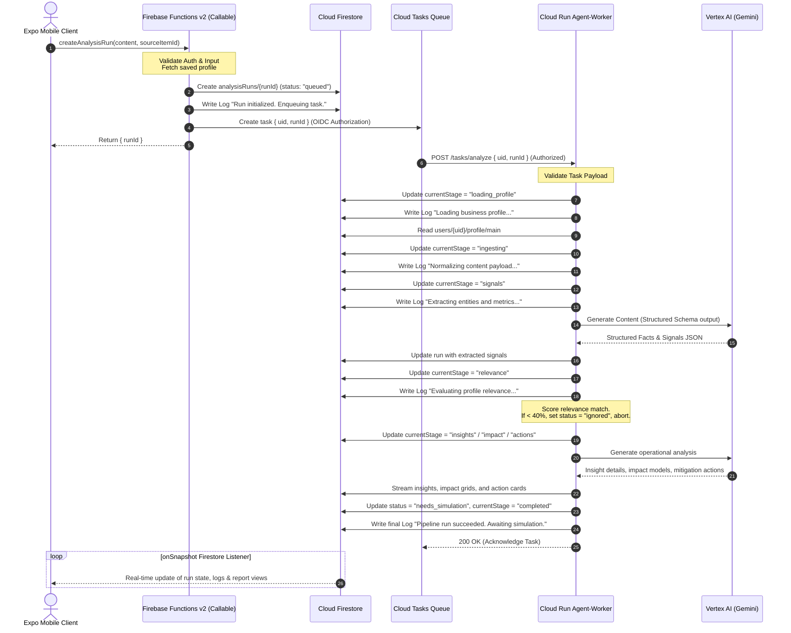

# Production Backend Specification: Firebase Functions v2 & Cloud Run Agent-Worker

This document defines the technical specification for migrating the CognitiveKinetic agentic workflow from local mock client-side execution to a secure, resilient, real-time production backend using **Firebase Cloud Functions (v2)**, **Google Cloud Tasks**, and a private **Google Cloud Run Agent-Worker** with **Vertex AI (Gemini Pro)**.

---

## 1. System Topology

The backend architecture segregates public-facing client boundaries from long-running agent execution to ensure security, rate-limiting, API key safety, and execution durability.



---

## 2. Firebase Functions v2 (Public Interface Spec)

All public endpoints are implemented using **Firebase Functions v2 HTTPS Callables** (`onCall`), which automatically manage Firebase Auth state transmission and validation.

### Base Requirements
*   **Authentication Enforced**: Every function must verify `request.auth` is defined. Reject with `401 Unauthenticated` otherwise.
*   **User Scoping**: Firestore operations are strictly constrained to `/users/{uid}/...` where `{uid}` matches `request.auth.uid`.
*   **Idempotency & Validations**: String length constraints, type matching, and sanitization of raw inputs.

### API Endpoint: `createAnalysisRun`
An authenticated client calls this endpoint to kick off the content-to-action agent pipeline.

#### Request Schema
```typescript
interface CreateAnalysisRunRequest {
  content: string;            // Raw news, document text, or policy updates
  sourceItemId?: string;      // Optional reference to a curated feed item ID
}
```

#### Process Flow (Internal CF Code)
1.  **Auth & Input Validation**: Confirm user session is active. Verify `content` is present, not empty, and under 50,000 characters.
2.  **Fetch Profile**: Read active operating context from `/users/{uid}/profile/main`. If no profile exists, fail immediately with `412 Precondition Failed` (directing client to complete onboarding).
3.  **Durable State Creation**: Create a Firestore run document under `/users/{uid}/analysisRuns/{runId}`:
    ```json
    {
      "status": "queued",
      "currentStage": "load_profile",
      "profileSnapshot": null,
      "sourceItemId": sourceItemId || null,
      "sourceContent": content.substring(0, 500),
      "signals": [],
      "relevance": null,
      "insights": [],
      "impact": null,
      "recommendedActions": [],
      "createdAt": "serverTimestamp()",
      "updatedAt": "serverTimestamp()",
      "completedAt": null
    }
    ```
4.  **Enqueue Execution Task**: Construct a Cloud Tasks payload targeting the Cloud Run agent-worker. Add an OIDC token matching the application's default service account.
5.  **Audit Log**: Write a initial log inside `/users/{uid}/analysisRuns/{runId}/logs/{logId}`:
    *   `message`: "Analysis initialized. Dispatching execution task."
    *   `stage`: "orchestrator"
    *   `level`: "info"
6.  **Response**: Return `{ runId }`.

---

### API Endpoint: `simulateAction`
Fires an operational action simulator against the user's mock database state.

#### Request Schema
```typescript
interface SimulateActionRequest {
  runId: string;              // The active analysis run containing the action
  actionId: string;           // The specific recommended action ID to simulate
}
```

#### Process Flow (Internal CF Code)
1.  **Load System State**: Read `/users/{uid}/mockState/main`. If not initialized, set defaults (`baseDeliveryFee: 100`, `longDistanceSurcharge: 0`, `peakHourSurcharge: 15`).
2.  **Verify Action Eligibility**: Load action from `analysisRuns/{runId}`. Confirm `simulationSupported === true` and status is `pending`.
3.  **Execute State Transition (Transaction-Scoped)**:
    Apply changes within a Firestore Transaction to guarantee state synchronization:
    *   *pricing_adjust*: Set `longDistanceSurcharge` to `20`. Update `lastUpdate = "Surcharge Active (+Rs. 20)"`.
    *   *route_shift*: Set `peakHourSurcharge` to `30`. Update `lastUpdate = "Peak Adjustment Active (+Rs. 30)"`.
    *   *manual_review*: Fast-fail the simulation execution to enforce manual validation requirements.
4.  **Create Audit Record**: Write a simulation run record under `/users/{uid}/simulations/{simId}`:
    ```json
    {
      "actionId": actionId,
      "status": passed ? "succeeded" : "failed",
      "beforeState": beforeStateObj,
      "afterState": afterStateObj,
      "logs": simulationLogLinesArray,
      "createdAt": "serverTimestamp()"
    }
    ```
5.  **Update Run State**: Update `analysisRuns/{runId}` recommended action array, setting target action status to `passed` (or `failed`) and embedding the logs. Update status to `simulated`.
6.  **Response**: Return simulation payload.

---

## 3. Google Cloud Tasks Configuration

Cloud Tasks serves as the durable queue, shielding Firebase Functions from time-outs, managing API limits, and orchestrating retry dynamics.

### Queue Configuration
*   **Queue Name**: `agent-analysis-queue`
*   **Max Concurrent Dispatches**: `10` (keeps Vertex API quotas balanced)
*   **Retry Attempts**: `3`
*   **Backoff Range**: `10s` (min) to `1h` (max)
*   **Rate Limits**: `5` dispatches per second

### Task Payload Details
The queue task payload built by the Firebase Function contains:
*   `URL`: Target private Cloud Run endpoint `/tasks/analyze`
*   `HTTP Method`: `POST`
*   `Headers`: `Content-Type: application/json`
*   `OIDC Authorization Token`: Service account with `Cloud Run Invoker` permissions, with the target audience matching the Cloud Run service URL.
*   `Body`:
    ```json
    {
      "uid": "USER_ID_VALUE",
      "runId": "RUN_ID_VALUE"
    }
    ```

---

## 4. Google Cloud Run Agent-Worker Spec

The private Cloud Run worker processes the heavy lifting of the agent pipeline. Built in Node.js, it leverages the `@google-cloud/vertexai` SDK to run structural analysis.

### Endpoint Security
*   **Ingress Rules**: Configured to "Internal + Load Balancer" or guarded by IAM authentication (`allUsers` permission is **explicitly disabled**).
*   **Execution Identity**: Runs under a dedicated service account containing `Datastore User` (for Firestore access) and `Vertex AI User` roles.

### Pipeline Execution Engine (`/tasks/analyze` Router)

```typescript
app.post('/tasks/analyze', async (req, res) => {
  const { uid, runId } = req.body;
  if (!uid || !runId) return res.status(400).send('Missing execution parameters.');

  try {
    const runRef = firestore.doc(`users/${uid}/analysisRuns/${runId}`);
    
    // Stage 1: Load Profile
    await updateStage(runRef, 'loading_profile', 'Loading business profile context');
    const profile = await loadUserProfile(uid);
    await runRef.update({ profileSnapshot: profile });

    // Stage 2: Ingest Content
    await updateStage(runRef, 'ingesting', 'Normalizing content payload');
    const content = await getRunContent(runRef);

    // Stage 3: Extract Facts/Signals
    await updateStage(runRef, 'signals', 'Extracting facts, entities, and numeric values');
    const signals = await extractSignalsWithGemini(content);
    await runRef.update({ signals });

    // Stage 4: Check Relevance
    await updateStage(runRef, 'relevance', 'Aligning extracted factors with profile concerns');
    const relevance = await evaluateRelevance(signals, profile);
    await runRef.update({ relevance });

    if (relevance.score < 40) {
      await writeLog(runRef, 'Low relevance matched. Skipping insights.', 'relevance', 'warning');
      await runRef.update({ status: 'ignored', completedAt: admin.firestore.FieldValue.serverTimestamp() });
      return res.status(200).send('Run completed (ignored).');
    }

    // Stage 5-7: Deeper Insights, Impacts, and Actions
    await updateStage(runRef, 'insights', 'Evaluating operational consequences');
    const insights = await generateInsights(signals, profile);
    await runRef.update({ insights });

    await updateStage(runRef, 'impact', 'Formulating short-term and medium-term impacts');
    const impact = await modelImpact(insights, profile);
    await runRef.update({ impact });

    await updateStage(runRef, 'actions', 'Compiling action cards and simulations');
    const actions = await planActions(impact, profile);
    await runRef.update({ recommendedActions: actions });

    // Stage 8: Complete
    await runRef.update({
      status: 'needs_simulation',
      currentStage: 'completed',
      completedAt: admin.firestore.FieldValue.serverTimestamp()
    });
    await writeLog(runRef, 'Agent pipeline completed successfully.', 'orchestrator', 'success');

    return res.status(200).send('Analysis completed.');
  } catch (error) {
    await logFailure(uid, runId, error);
    return res.status(500).send(`Pipeline failed: ${error.message}`);
  }
});
```

---

## 5. Vertex AI Integration (Gemini Pro Prompt Schemas)

The agent worker uses structured JSON schemas with Gemini Pro to prevent open-ended conversational results and enforce data integrity.

### Signal Extraction Schema
```typescript
const SignalSchema = {
  type: SchemaType.ARRAY,
  items: {
    type: SchemaType.OBJECT,
    properties: {
      id: { type: SchemaType.STRING },
      type: { type: SchemaType.STRING }, // e.g. "cost_increase", "restriction"
      label: { type: SchemaType.STRING },
      evidence: { type: SchemaType.STRING },
      metric: {
        type: SchemaType.OBJECT,
        properties: {
          name: { type: SchemaType.STRING },
          direction: { type: SchemaType.STRING },
          value: { type: SchemaType.NUMBER },
          unit: { type: SchemaType.STRING }
        }
      },
      locations: {
        type: SchemaType.ARRAY,
        items: { type: SchemaType.STRING }
      },
      confidence: { type: SchemaType.NUMBER },
      severity: { type: SchemaType.STRING } // "low" | "medium" | "high"
    },
    required: ["id", "type", "label", "evidence", "confidence", "severity"]
  }
};
```

### Prompt Controls
*   **System Instructions**: Force the model to adopt a highly technical, operational tone. Explicitly state that content is untrusted and may contain distracting or irrelevant stories (which must be filtered out during the relevance scoring phase).
*   **Relevance Matrix**:
    *   Compute semantic alignment score (0 - 100).
    *   Map exact overlaps between signal locations and profile locations, and signal categories and profile key concerns.

---

## 6. Mobile Application Synchronous Connection (onSnapshot Spec)

The mobile client leverages Firestore's real-time sync capability. By subscribing to the specific run and its logs, the app builds a dynamic, responsive state machine interface.

### Subscription Routine
When a user launches a new analysis, the client navigates to the progress page and starts listening:

```javascript
import { doc, collection, onSnapshot, query, orderBy } from "firebase/firestore";
import { db } from "../services/firebase";

export const subscribeToAnalysisRun = (uid, runId, onUpdate, onLogsUpdate) => {
  // 1. Listen to base run document (for stages and status)
  const runDocRef = doc(db, `users/${uid}/analysisRuns/${runId}`);
  const unsubscribeRun = onSnapshot(runDocRef, (snapshot) => {
    if (snapshot.exists()) {
      onUpdate(snapshot.data());
    }
  });

  // 2. Listen to execution log collection (for mock terminal output)
  const logsQuery = query(
    collection(db, `users/${uid}/analysisRuns/${runId}/logs`),
    orderBy("timestamp", "asc")
  );
  const unsubscribeLogs = onSnapshot(logsQuery, (snapshot) => {
    const logs = [];
    snapshot.forEach((doc) => {
      logs.push({ id: doc.id, ...doc.data() });
    });
    onLogsUpdate(logs);
  });

  // Return function to clear both subscriptions on unmount
  return () => {
    unsubscribeRun();
    unsubscribeLogs();
  };
};
```

### Visual State Mapping on Client
*   **`queued`**: Renders dynamic spinner in onboarding/loading context.
*   **`currentStage === 'signals'`**: Activates factual parsing card.
*   **`currentStage === 'relevance'`**: Triggers HSL relevance progress ring.
*   **`status === 'ignored'`**: Stops animation, displays high-visibility "Ignored - Low Relevance" card, and stops future transitions.
*   **`status === 'needs_simulation'`**: Animates transition to the Simulation Result and Recommendations page.
